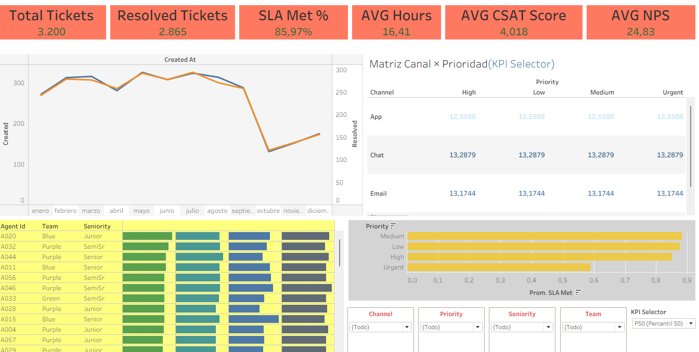
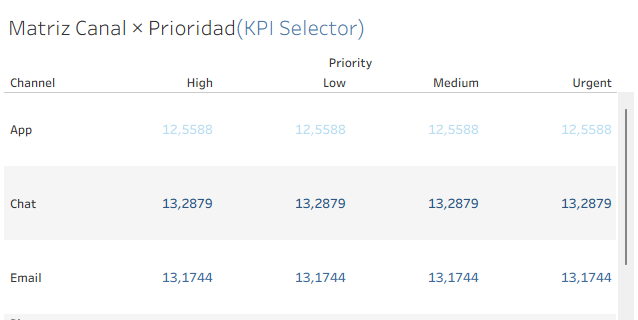
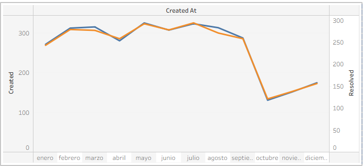
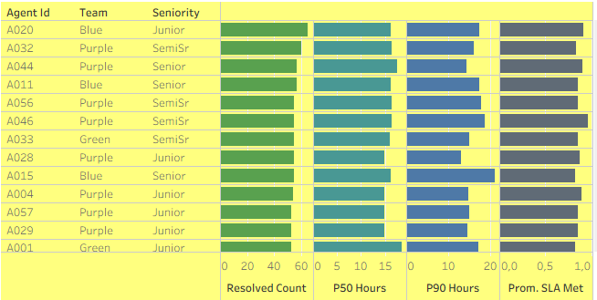

# Proyecto 4 — Tableau: Soporte / Atención al Cliente
**Rol:** Data/BI Analyst · **Herramientas:** Tableau (Table Calcs, percentiles, parámetros)

## Objetivo
Dashboard: SLA, tiempos (avg/p50/p90), canal × prioridad, tendencia mensual, ranking de agentes/sucursales.

## Datos
CSV del [Proyecto 2 (PostgreSQL)](https://github.com/2005leo/proyecto-sql-soporte).

## Cálculos clave
- **Resolution Hours** = DATEDIFF('minute',[created_at],[resolved_at]) / 60 (solo resueltos)
- **SLA Met** = 1 si [Resolution Hours] ≤ [sla_target_hours]
- **P50** = WINDOW_PERCENTILE( AVG([Resolution Hours]) , 0.5 )
- **P90** = WINDOW_PERCENTILE( AVG([Resolution Hours]) , 0.9 )
- **KPI Selector** (parámetro) → **KPI Value** (Avg/P50/P90)

## Capturas

## Archivo
[`twbx/proyecto4_support_tableau.twbx`](twbx/proyecto4_support_tableau.twbx)
